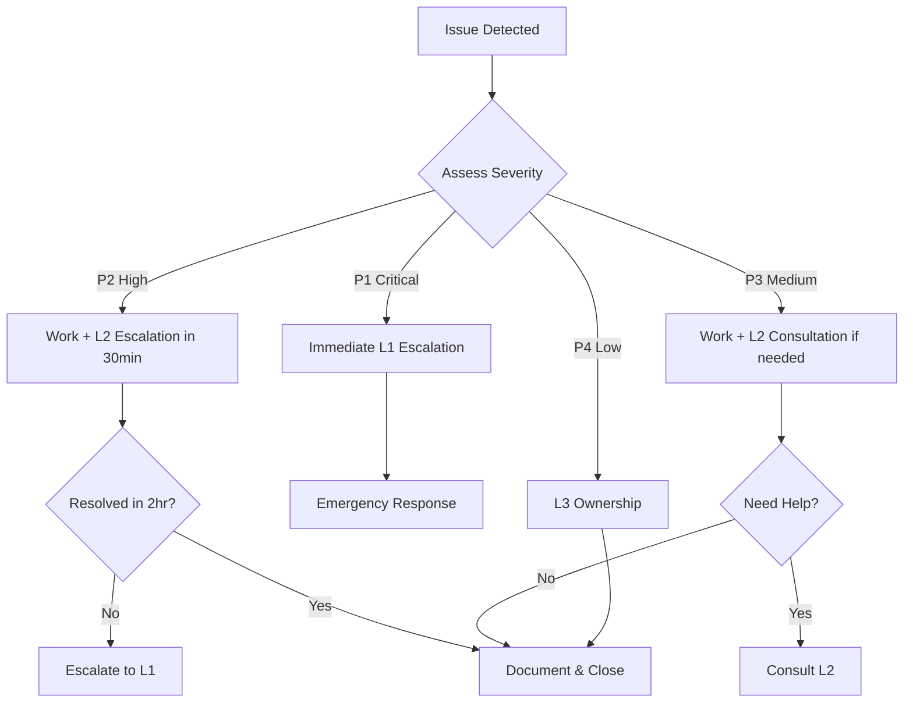

# Energy for Health (E4H) Operations Guide

## Table of Contents
1. [Overview](#overview)
2. [Service Architecture](#service-architecture)
3. [Escalation Procedures](#escalation-procedures)
4. [Monitoring and Observability Stack](#monitoring-and-observability-stack)
5. [Troubleshooting Runbooks](#troubleshooting-runbooks)
6. [Operational Procedures](#operational-procedures)
7. [Emergency Response](#emergency-response)
8. [Appendices](#appendices)

---

## 1. Overview

### 1.1 Purpose
This Operations Guide is designed for L1 engineers managing the Energy for Health (E4H) platform built on the DIGIT framework. It provides comprehensive guidance on monitoring, troubleshooting, escalation procedures, and operational best practices.

### 1.2 Target Audience
- **Primary**: L1 Operations Engineers
- **Secondary**: L2 Senior Engineers, L3 Technical Leads

### 1.3 System Overview
The E4H platform is deployed using Kubernetes on AWS infrastructure with the following key components:
- **Frontend**: DIGIT UI with state-specific configurations
- **Backend Services**: Core DIGIT microservices
- **Database**: PostgreSQL RDS
- **Message Queue**: Kafka (Kraft mode)
- **Search**: Elasticsearch
- **Monitoring**: Grafana, Prometheus, Loki, Jaeger

### 1.4 Environments
- **Development**: `https://e4h-dev.selcofoundation.org/`
- **UAT**: `https://saura-emitra-uat.selcofoundation.org/` 
- **Production**: `https://saura-emitra.selcofoundation.org/` configuration

---

## 2. Service Architecture

### 2.1 Core Components

#### 2.1.1 Frontend Services
- **digit-ui**: Main user interface
- **State-specific UIs**: Meghalaya, Nagaland, Assam, Manipur, Mizoram, Odisha etc

#### 2.1.2 Backend Services
- **egov-user**: User management and authentication
- **egov-accesscontrol**: Authorization and access control
- **Gateway**: API gateway for routing
- **Core services**: Location, MDMS, Workflow, etc.

#### 2.1.3 Infrastructure Services
- **PostgreSQL**: Primary database
- **Kafka**: Message streaming
- **Elasticsearch**: Search and analytics
- **Redis**: Caching layer

### 2.2 Deployment Architecture
```
Internet → Ingress-Nginx → DIGIT Services → PostgreSQL RDS
                        ↓
                    Kafka/Redis/ES
                        ↓
                    Monitoring Stack
```

---

## 3. Escalation Procedures

### 3.1 Severity Levels

#### 3.1.1 Critical (P0) - Immediate Escalation to L3
**Definition**: Complete service outage affecting all users
**Examples**:
- Platform completely inaccessible
- Database connection failures
- Critical security breaches
- Data corruption incidents

**Response Time**: Immediate (< 15 minutes)
**Escalation Path**: L1 → L2 → L3 → Management
**Communication**: Phone call + Slack + Email

#### 3.1.2 High (P1) - Escalate to L2 within 30 minutes
**Definition**: Significant functionality impaired, affecting major user workflows
**Examples**:
- Single state UI completely down
- Authentication service degraded
- Performance degradation > 50%

**Response Time**: < 30 minutes
**Escalation Path**: L1 → L2 (L3 if no resolution in 2 hours)
**Communication**: Slack + Email

#### 3.1.3 Medium (P2) - L1 Ownership with L2 Consultation
**Definition**: Partial functionality issues, workarounds available
**Examples**:
- Minor UI glitches
- Non-critical service warnings
- Performance degradation < 30%

**Response Time**: < 2 hours
**Escalation Path**: L1 handles, consult L3 if needed
**Communication**: Slack + Ticket system

#### 3.1.4 Low (P3) - L1 Ownership
**Definition**: Minor issues, enhancement requests
**Examples**:
- Cosmetic UI issues
- Documentation updates
- Non-urgent configuration changes

**Response Time**: < 24 hours
**Escalation Path**: L1 ownership
**Communication**: Ticket system

### 3.2 Escalation Contacts

```yaml
L3_Contacts:
  - name: "Technical Lead"
    phone: "+91-XXXXXXXXXX"
    email: "lead@selcofoundation.org"
    slack: "@tech-lead"
    
L2_Contacts:
  - name: "Senior Engineer"
    phone: "+91-XXXXXXXXXX" 
    email: "senior@selcofoundation.org"
    slack: "@senior-eng"

Emergency_Contacts:
  - name: "DevOps Manager"
    phone: "+91-XXXXXXXXXX"
    email: "devops-mgr@selcofoundation.org"
```

### 3.3 Escalation Workflow



---

## 4. Monitoring and Observability Stack

### 4.1 Grafana - Visualization and Dashboards

#### 4.1.1 Access
- **URL**: `https://saura-emitra.selcofoundation.org/monitoring`
- **Authentication**: Grafana native auth
- **Default Credentials**: Check with admin

#### 4.1.2 Key Dashboards

#### Resource Utilization (Nodes & Kubernetes Resources)

- **Node-level:**
    - CPU, Memory, and Disk usage per node
    - Node health and availability
- **Pod-level:**
    - CPU and Memory utilization per pod
    - Resource throttling or OOMKill events
- **Deployment/Namespace-level:**
    - Aggregated resource consumption by namespace or deployment
    - Identify top resource consumers
- **Trends:**
    - Historical usage patterns
    - Peak utilization insights

---

####  Network Metrics

- Ingress and Egress traffic volume
- Network latency and response time
- Packet drops, retransmissions, and error rates

---

####  Persistent Volume Information

- Persistent Volumes (PV) and Persistent Volume Claims (PVC) status
- Storage capacity, usage, and remaining space

---


#### 4.1.3 Alert Configuration
```yaml
Alert_Rules:
  - name: "Minimum Number of Replicas Breached"
    condition: "replica_count > minimum_threshold"
    duration: "5m"
    severity: "warning"
    summary: "Number of replicas for HorizontalPodAutoscaler has crossed the minimum threshold of 2 replicas."

  - name: "Out of Memory"
    condition: "container_memory_usage > limit"
    duration: "5m"
    severity: "critical"
    summary: "Container faced Out of Memory issue causing disruption. Review memory allocation and fix."

  - name: "Readiness Check Failed"
    condition: "kube_pod_container_status_ready == 0"
    duration: "5m"
    severity: "critical"
    summary: "Container readiness check failed. Pod not ready to serve traffic."

  - name: "CronJob Execution Status"
    condition: "cronjob execution failed"
    duration: "5m"
    severity: "warning"
    summary: "CronJob execution failed."

  - name: "Storage Status in PVC"
    condition: "pvc_usage_percent > 75%"
    duration: "5m"
    severity: "warning"
    summary: "PVC storage is almost 75% full. Take action to prevent data loss."

  - name: "Node Memory Availability"
    condition: "node_memory_available_percent < 20%"
    duration: "5m"
    severity: "critical"
    summary: "Node memory availability dropped below 20%. Enable or increase resources."

  - name: "Pod CrashLoopBackOff"
    condition: "container_restarts > 3 within 5m"
    duration: "5m"
    severity: "critical"
    summary: "Pod restarted more than 3 times in 5 minutes. Debug and resolve the issue."

  - name: "Resource Deployment Pending"
    condition: "pod_status_pending_duration > 5m"
    duration: "5m"
    severity: "warning"
    summary: "Pod stuck in Pending state. Check scheduling constraints or resource availability."

  - name: "Node CPU Availability"
    condition: "node_cpu_available_percent < 25%"
    duration: "5m"
    severity: "critical"
    summary: "CPU availability on one of the nodes fell below 25%. Take corrective action."

### 4.2 Prometheus - Metrics Collection

#### 4.2.1 Configuration
- **Namespace**: `monitoring`
- **Storage**: Local PVC (configure retention policy)
- **Scrape Interval**: 30s (configurable per job)

#### 4.2.2 Key Metrics to Monitor

**Application Metrics**
```promql
# Service availability
up{job="egov-services"}

# Request rate
rate(http_requests_total[5m])

# Error rate  
rate(http_requests_total{status=~"5.."}[5m]) / rate(http_requests_total[5m])

# Response time
histogram_quantile(0.95, rate(http_request_duration_seconds_bucket[5m]))
```

**Infrastructure Metrics**
```promql
# CPU usage
100 - (avg by (instance) (rate(node_cpu_seconds_total{mode="idle"}[2m])) * 100)

# Memory usage
(1 - (node_memory_MemAvailable_bytes / node_memory_MemTotal_bytes)) * 100

# Disk usage
100 - ((node_filesystem_avail_bytes * 100) / node_filesystem_size_bytes)
```

**Database Metrics**
```promql
# Connection pool usage
pg_stat_database_numbackends / pg_settings_max_connections * 100

# Query performance
rate(pg_stat_database_tup_fetched[5m])

# Database size
pg_database_size_bytes
```

#### 4.2.3 Prometheus Queries for Troubleshooting

**Service Health Check**
```promql
# Services that are down
up{job=~"egov-.*"} == 0

# Services with high error rates
rate(http_requests_total{status=~"5.."}[5m]) > 0.1
```

**Performance Issues**
```promql
# Slow services (> 1s response time)
histogram_quantile(0.95, rate(http_request_duration_seconds_bucket[5m])) > 1

# High CPU usage services
rate(container_cpu_usage_seconds_total[5m]) > 0.8
```

### 4.3 Alertmanager - Alert Management

#### 4.3.1 Configuration
```yaml
global:
  smtp_from: 'alerts@selcofoundation.org'
  
route:
  group_by: ['alertname', 'severity']
  group_wait: 30s
  group_interval: 5m
  repeat_interval: 12h
  receiver: 'default'
  routes:
  - match:
      severity: critical
    receiver: 'critical-alerts'
  - match:
      severity: warning  
    receiver: 'warning-alerts'

receivers:
- name: 'default'
  email_configs:
  - to: 'devops@selcofoundation.org'
    subject: 'E4H Alert: {{ .GroupLabels.alertname }}'
    
- name: 'critical-alerts'
  email_configs:
  - to: 'devops@selcofoundation.org,management@selcofoundation.org'
  slack_configs:
  - api_url: 'SLACK_WEBHOOK_URL'
    channel: '#alerts-critical'
    
- name: 'warning-alerts'
  slack_configs:
  - api_url: 'SLACK_WEBHOOK_URL'
    channel: '#alerts-warning'
```

#### 4.3.2 Alert Handling Procedure
1. **Receive Alert**: Check Slack, email, or Grafana
2. **Assess Severity**: Use severity matrix from Section 3.1
3. **Initial Response**: Acknowledge alert and begin investigation
4. **Escalate if Needed**: Follow escalation matrix
5. **Document**: Record findings and resolution steps
6. **Close**: Mark alert as resolved with root cause

### 4.4 Loki - Log Management

#### 4.4.1 Access and Configuration
- **Grafana Integration**: Use Explore section
- **Log Retention**: 30 days (configurable)
- **Log Sources**: All Kubernetes pods, ingress, system logs

#### 4.4.2 Log Query Examples

**Application Logs**
```logql
# All logs from user service
{app="egov-user"}

# Error logs across all services
{namespace="default"} |= "ERROR"

# Logs from specific pod
{pod=~"egov-user-.*"} 

# Logs with specific error patterns
{app="egov-user"} |~ "(?i)exception|error|fail"
```

**Performance Analysis**
```logql
# Slow database queries
{app=~"egov-.*"} |~ "slow query" | logfmt | duration > 1000ms

# Authentication failures
{app="egov-user"} |= "authentication failed"

# High memory usage warnings
{namespace="default"} |= "OutOfMemory"
```

#### 4.4.3 Log Analysis Workflow
1. **Identify Issue**: From alert or user report
2. **Time Range**: Set appropriate time window
3. **Filter Services**: Focus on relevant applications
4. **Search Patterns**: Use regex for specific errors
5. **Correlate**: Cross-reference with metrics
6. **Export**: Save relevant logs for analysis

### 4.5 Jaeger - Distributed Tracing (Partial Coverage)

#### 4.5.1 Current Status
- **Implementation**: Partial coverage
- **Services Covered**: Gateway, core services
- **Storage**: Elasticsearch backend

#### 4.5.2 Trace Analysis
```
# Access Jaeger UI
https://e4h-dev.selcofoundation.org/jaeger

# Key trace patterns to monitor:
- Request flow through microservices
- Database query performance
- External API call latencies
- Error propagation paths
```

#### 4.5.3 Performance Investigation
1. **Search by Service**: Filter traces by service name
2. **Error Traces**: Look for failed spans
3. **Latency Analysis**: Identify slow operations
4. **Dependency Map**: Understand service interactions

---

## 5. Troubleshooting Runbooks

### 5.1 Common Issues and Resolution

#### 5.1.1 Service Unavailable (HTTP 503)

**Symptoms**:
- Users unable to access specific features
- Load balancer returning 503 errors
- Grafana showing service down

**Investigation Steps**:
1. Check service status:
   ```bash
   kubectl get pods -n default | grep <service-name>
   kubectl describe pod <pod-name> -n default
   ```

2. Check service logs:
   ```bash
   kubectl logs <pod-name> -n default --tail=100
   ```

3. Verify service configuration:
   ```bash
   kubectl get svc <service-name> -n default
   kubectl get ingress -n default
   ```

**Resolution**:
- If pod is crash-looping: Check resource limits and application logs
- If pod is pending: Check node resources and scheduling constraints
- If config issue: Verify service and ingress configurations

**Escalation Criteria**: If unable to restore service within 30 minutes (P2) or if critical service (P1)

#### 5.1.2 Database Connection Issues

**Symptoms**:
- Connection timeout errors in logs
- High database connection count
- Slow query performance

**Investigation Steps**:
1. Check database connectivity:
   ```bash
   # From a pod
   kubectl exec -it <pod-name> -- nc -zv <db-host> 5432
   ```

2. Monitor connection metrics:
   ```promql
   pg_stat_database_numbackends{datname="selcodevdb"}
   ```

3. Check database logs in RDS console

**Resolution**:
- Scale up connection pools if needed
- Identify and terminate long-running queries
- Check RDS instance health and resource utilization

**Escalation Criteria**: Database outage (P1), significant performance degradation (P2)

#### 5.1.3 High Memory/CPU Usage

**Symptoms**:
- Pod memory limit exceeded
- CPU throttling
- Slow response times

**Investigation Steps**:
1. Check resource usage:
   ```bash
   kubectl top pods -n default
   kubectl describe pod <pod-name> -n default
   ```

2. Review metrics in Grafana:
   ```promql
   container_memory_usage_bytes{pod=~"<service>.*"}
   rate(container_cpu_usage_seconds_total{pod=~"<service>.*"}[5m])
   ```

**Resolution**:
- Increase resource limits if justified
- Check for memory leaks in application logs
- Scale horizontally if needed

#### 5.1.4 Kafka Issues

**Symptoms**:
- Message processing delays
- Consumer lag alerts
- Service unable to publish/consume messages

**Investigation Steps**:
1. Check Kafka cluster health:
   ```bash
   kubectl get pods -n backbone-dev | grep kafka
   kubectl logs kafka-kraft-controller-0 -n backbone-dev
   ```

2. Monitor consumer lag:
   ```bash
   # Use Kafka UI or command line tools
   kubectl exec -it kafka-kraft-controller-0 -n backbone-dev -- kafka-consumer-groups.sh --bootstrap-server localhost:9092 --list
   ```

**Resolution**:
- Restart affected consumers
- Check topic configuration and partitioning
- Monitor disk space on Kafka nodes

### 5.2 Performance Troubleshooting

#### 5.2.1 Slow Response Times

**Investigation Workflow**:
1. **Identify Affected Services**: Use Grafana APM dashboard
2. **Check Database Performance**: Monitor slow query logs
3. **Review Resource Usage**: CPU, memory, network metrics
4. **Analyze Traces**: Use Jaeger for request flow analysis
5. **Check External Dependencies**: Third-party API response times

#### 5.2.2 Memory Leaks

**Detection**:
```promql
# Increasing memory usage over time
increase(container_memory_usage_bytes[24h]) > 0
```

**Investigation**:
1. Enable heap dumps for Java applications
2. Analyze GC patterns and frequency
3. Review application logs for OutOfMemory errors
4. Check for resource cleanup in code

### 5.3 Security Incident Response

#### 5.3.1 Suspected Security Breach

**Immediate Actions** (P1 - Critical):
1. **Isolate**: Disable affected services/accounts
2. **Preserve Evidence**: Take system snapshots
3. **Assess Scope**: Check logs for breach extent
4. **Notify**: Immediate escalation to L1 and security team
5. **Document**: Record all actions taken

**Investigation Steps**:
1. Review authentication logs
2. Check for suspicious network activity
3. Analyze file system changes
4. Review privilege escalations

---

## 6. Operational Procedures

### 6.1 Routine Maintenance Tasks

#### 6.1.1 Daily Checks (Automated via Monitoring)
- [ ] System health dashboard review
- [ ] Critical alert review
- [ ] Backup status verification
- [ ] Resource utilization check
- [ ] Security event review

#### 6.1.2 Weekly Tasks
- [ ] Log rotation verification
- [ ] Certificate expiry check (30-day warning)
- [ ] Database maintenance window planning
- [ ] Capacity planning review
- [ ] Performance trend analysis

#### 6.1.3 Monthly Tasks
- [ ] Security patch assessment
- [ ] Disaster recovery testing
- [ ] Monitoring rule review and optimization
- [ ] Documentation updates
- [ ] Runbook validation

### 6.2 Deployment Procedures

#### 6.2.1 Standard Deployment Process

**Pre-deployment Checklist**:
- [ ] Code review completed
- [ ] Security scan passed
- [ ] Staging environment tested
- [ ] Rollback plan prepared
- [ ] Change window scheduled

**Deployment Steps**:
1. **Preparation**:
   ```bash
   # Take database backup
   # Update Helm charts
   # Verify configuration changes
   ```

2. **Deployment**:
   ```bash
   # Deploy using helmfile
   helmfile -e <environment> sync
   
   # Verify deployment
   kubectl get pods -n default
   kubectl rollout status deployment/<service-name>
   ```

3. **Validation**:
   - Health check endpoints
   - Smoke tests
   - Performance verification
   - User acceptance testing

4. **Post-deployment**:
   - Monitor metrics for anomalies
   - Document deployment
   - Update runbooks if needed

#### 6.2.2 Emergency Deployment (Hotfix)

**Criteria for Emergency Deployment**:
- Critical security vulnerability
- Data corruption fix
- Service outage resolution

**Expedited Process**:
1. **Approval**: L2/L1 sign-off required
2. **Testing**: Minimal viable testing
3. **Deployment**: Direct to production with monitoring
4. **Rollback Ready**: Immediate rollback capability

### 6.3 Backup and Recovery

#### 6.3.1 Backup Strategy

**Database Backups**:
- **Frequency**: Daily automated backups
- **Retention**: 30 days for daily, 12 months for weekly
- **Location**: S3 cross-region replication
- **Verification**: Weekly restore testing

**Configuration Backups**:
- **Kubernetes manifests**: Git repository
- **Helm charts**: Version controlled
- **Secrets**: Encrypted backup in secure storage

#### 6.3.2 Recovery Procedures

**Database Recovery**:
```bash
# Point-in-time recovery
aws rds restore-db-instance-to-point-in-time \
  --source-db-instance-identifier selco-prod-db \
  --target-db-instance-identifier selco-recovery-db \
  --restore-time 2023-12-01T10:00:00.000Z
```

**Application Recovery**:
```bash
# Rollback deployment
kubectl rollout undo deployment/<service-name>

# Restore from backup
helmfile -e <environment> sync --set image.tag=<previous-version>
```

### 6.4 Capacity Management

#### 6.4.1 Monitoring Thresholds

**Infrastructure Alerts**:
```yaml
CPU_Usage: 
  warning: 70%
  critical: 85%
  
Memory_Usage:
  warning: 75%
  critical: 90%
  
Disk_Usage:
  warning: 80%
  critical: 90%
  
Database_Connections:
  warning: 70%
  critical: 85%
```

#### 6.4.2 Scaling Procedures

**Horizontal Pod Autoscaler**:
```yaml
apiVersion: autoscaling/v2
kind: HorizontalPodAutoscaler
metadata:
  name: egov-user-hpa
spec:
  scaleTargetRef:
    apiVersion: apps/v1
    kind: Deployment
    name: egov-user
  minReplicas: 2
  maxReplicas: 10
  metrics:
  - type: Resource
    resource:
      name: cpu
      target:
        type: Utilization
        averageUtilization: 70
```

**Manual Scaling**:
```bash
# Scale deployment
kubectl scale deployment <service-name> --replicas=<count>

# Scale RDS instance (requires downtime)
aws rds modify-db-instance --db-instance-identifier <db-name> --db-instance-class <new-class>
```

---

## 7. Emergency Response

### 7.1 Incident Response Team

**Roles and Responsibilities**:

| Role | Responsibility | Contact Method |
|------|----------------|----------------|
| Incident Commander (L1) | Overall coordination, external communication | Phone, Slack |
| Technical Lead (L2) | Technical investigation and resolution | Phone, Slack |
| Operations Engineer (L3) | System monitoring, initial triage | Slack, Email |
| Communication Lead | Stakeholder updates, user communication | Email, Portal |

### 7.2 Emergency Contacts

```yaml
Emergency_Hotline: "+91-XXXXXXXXXX"
Slack_Channel: "#incident-response"
Email_List: "emergency@selcofoundation.org"

Vendor_Contacts:
  AWS_Support: "Premium Support - 24/7"
  Database_Expert: "+91-XXXXXXXXXX"
  Security_Team: "security@selcofoundation.org"
```

### 7.3 Emergency Procedures

#### 7.3.1 Major Incident Declaration (P1)

**Triggers**:
- Complete platform outage (>5 min)
- Data breach or security incident
- Critical data corruption
- Regulatory compliance breach

**Response Process**:
1. **Immediate (0-5 min)**:
   - Alert incident commander
   - Create incident war room (Slack channel)
   - Assign roles and responsibilities
   - Begin status page updates

2. **Short-term (5-30 min)**:
   - Assess impact and scope
   - Implement immediate mitigation
   - Prepare communication plan
   - Coordinate with external vendors if needed

3. **Resolution Phase**:
   - Execute recovery procedures
   - Monitor system stability
   - Conduct impact assessment
   - Document timeline and actions

4. **Post-Incident**:
   - Conduct post-mortem within 24 hours
   - Update runbooks and procedures
   - Implement preventive measures
   - Share lessons learned

#### 7.3.2 Communication Templates

**Internal Incident Declaration**:
```
🚨 INCIDENT DECLARED - P1 CRITICAL 🚨
Time: [TIMESTAMP]
Service: E4H Platform
Impact: [DESCRIPTION]
Incident Commander: [NAME]
War Room: #incident-[TIMESTAMP]
Status Page: [URL]
Next Update: [TIME]
```

**User Communication**:
```
Subject: E4H Service Disruption - [STATUS]

We are currently experiencing issues with the E4H platform that may affect your access to services. 

Status: [INVESTIGATING/IDENTIFIED/MONITORING/RESOLVED]
Impact: [DESCRIPTION]
ETA: [ESTIMATED RESOLUTION TIME]
Workaround: [IF APPLICABLE]

We apologize for the inconvenience and are working to resolve this as quickly as possible.

Updates: [STATUS PAGE URL]
Support: support@selcofoundation.org
```

### 7.4 Disaster Recovery

#### 7.4.1 Recovery Time Objectives (RTO)

| Component | RTO | RPO |
|-----------|-----|-----|
| Database | 4 hours | 15 minutes |
| Application Services | 2 hours | 0 (stateless) |
| File Storage | 4 hours | 1 hour |
| Full Platform | 6 hours | 30 minutes |

#### 7.4.2 Disaster Scenarios

**Scenario 1: Complete AWS Region Failure**
1. Activate cross-region replica
2. Update DNS to point to backup region
3. Restore application services in backup region
4. Validate data consistency
5. Communicate with stakeholders

**Scenario 2: Database Corruption**
1. Stop all write operations
2. Assess corruption scope
3. Restore from latest clean backup
4. Apply transaction logs if possible
5. Validate data integrity before resuming operations

**Scenario 3: Kubernetes Cluster Failure**
1. Provision new cluster using Infrastructure as Code
2. Restore application deployments from Git
3. Restore persistent volumes from backups
4. Update load balancer configurations
5. Validate all services operational

---

## 8. Appendices

### 8.1 Useful Commands Reference

#### 8.1.1 Kubernetes Commands
```bash
# Pod management
kubectl get pods -n <namespace> -o wide
kubectl describe pod <pod-name> -n <namespace>
kubectl logs <pod-name> -n <namespace> --tail=100 -f
kubectl exec -it <pod-name> -n <namespace> -- /bin/bash

# Service debugging
kubectl get svc -n <namespace>
kubectl get endpoints <service-name> -n <namespace>
kubectl port-forward svc/<service-name> 8080:80 -n <namespace>

# Configuration
kubectl get configmap -n <namespace>
kubectl get secrets -n <namespace>
kubectl describe configmap <configmap-name> -n <namespace>

# Resource monitoring
kubectl top nodes
kubectl top pods -n <namespace>
kubectl get events --sort-by=.metadata.creationTimestamp -n <namespace>
```

#### 8.1.2 Database Commands
```sql
-- Connection monitoring
SELECT count(*) FROM pg_stat_activity;
SELECT state, count(*) FROM pg_stat_activity GROUP BY state;

-- Performance analysis
SELECT query, calls, total_time, mean_time 
FROM pg_stat_statements 
ORDER BY total_time DESC LIMIT 10;

-- Lock monitoring
SELECT blocked_locks.pid AS blocked_pid,
       blocked_activity.usename AS blocked_user,
       blocking_locks.pid AS blocking_pid,
       blocking_activity.usename AS blocking_user,
       blocked_activity.query AS blocked_statement
FROM pg_catalog.pg_locks blocked_locks
JOIN pg_catalog.pg_stat_activity blocked_activity 
  ON blocked_activity.pid = blocked_locks.pid
JOIN pg_catalog.pg_locks blocking_locks 
  ON blocking_locks.locktype = blocked_locks.locktype;
```

#### 8.1.3 Monitoring Commands
```bash
# Prometheus queries
curl -G 'http://prometheus:9090/api/v1/query' \
  --data-urlencode 'query=up{job="kubernetes-pods"}'

# Grafana API
curl -H "Authorization: Bearer <token>" \
  http://grafana:3000/api/dashboards/home

# Loki queries  
curl -G 'http://loki:3100/loki/api/v1/query_range' \
  --data-urlencode 'query={app="egov-user"}' \
  --data-urlencode 'start=2023-12-01T10:00:00Z' \
  --data-urlencode 'end=2023-12-01T11:00:00Z'
```

### 8.2 Configuration Files Reference

#### 8.2.1 Key Configuration Locations
```
/deploy-as-code/charts/environments/
├── selco-dev.yaml          # Development environment config
├── selco-dev-secrets.yaml  # Development secrets
├── selco-uat.yaml          # UAT environment config  
├── selco-uat-secrets.yaml  # UAT secrets
├── selco-prod.yaml         # Production environment config
└── selco-prod-secrets.yaml # Production secrets
```

#### 8.2.2 Important Configuration Parameters
```yaml
# Database configuration
db-host: "selco-prod-db.c1yks4g2c2zp.ap-south-1.rds.amazonaws.com"
db-name: "selcodevdb"
db-url: "jdbc:postgresql://..."

# Service endpoints
egov-services-fqdn-name: "https://e4h-dev.selcofoundation.org/"
kafka-brokers: "kafka-kraft-controller-headless.backbone-dev:9092"
es-indexer-host: "https://elasticsearch-data.backbone-dev:9200/"

# Authentication
access-token-validity: 10080
refresh-token-validity: 20160
citizen-otp-fixed: "123456"
```

### 8.3 Monitoring Queries Library

#### 8.3.1 System Health Queries
```promql
# Overall system health
up{job=~"egov-.*"}

# Service availability (last 5 minutes)
avg_over_time(up{job=~"egov-.*"}[5m])

# Error rate by service
rate(http_requests_total{status=~"5.."}[5m]) / rate(http_requests_total[5m]) * 100

# Response time 95th percentile
histogram_quantile(0.95, 
  rate(http_request_duration_seconds_bucket[5m])
)
```

#### 8.3.2 Infrastructure Queries
```promql
# Node resource utilization
100 - (avg by (instance) (irate(node_cpu_seconds_total{mode="idle"}[5m])) * 100)
(1 - (node_memory_MemAvailable_bytes / node_memory_MemTotal_bytes)) * 100
100 - ((node_filesystem_avail_bytes * 100) / node_filesystem_size_bytes)

# Pod resource usage  
sum by (pod) (container_memory_usage_bytes{container!="POD"})
sum by (pod) (rate(container_cpu_usage_seconds_total{container!="POD"}[5m]))
```

#### 8.3.3 Business Metrics Queries
```promql
# User registration rate
rate(egov_user_registrations_total[1h])

# API request volume by endpoint
sum by (endpoint) (rate(http_requests_total[5m]))

# Database connection pool usage
pg_stat_database_numbackends / pg_settings_max_connections * 100
```

### 8.4 Log Analysis Patterns

#### 8.4.1 Common Log Queries
```logql
# Application errors
{namespace="default"} |= "ERROR" | json | error != ""

# Authentication failures
{app="egov-user"} |~ "(?i)authentication.*fail|login.*fail|invalid.*credential"

# Database connection issues
{namespace="default"} |~ "(?i)connection.*timeout|connection.*refused|connection.*pool"

# Performance issues
{namespace="default"} |~ "(?i)slow.*query|timeout|performance"

# Security events
{namespace="default"} |~ "(?i)unauthorized|forbidden|access.*denied|security.*violation"
```

#### 8.4.2 Log Parsing Examples
```logql
# Extract response times
{app="gateway"} | logfmt | duration > 1000ms

# Parse JSON logs
{app="egov-user"} | json | level="ERROR"

# Extract specific fields
{app="egov-user"} | regexp "user_id=(?P<user_id>\\d+)" | user_id = "12345"
```

### 8.5 Contact Information

#### 8.5.1 Team Contacts
```yaml
DevOps_Team:
  - name: "L3 Engineer"
    email: "l3-engineer@selcofoundation.org"
    slack: "@l3-engineer"
    phone: "+91-XXXXXXXXXX"
    
  - name: "L2 Senior Engineer"  
    email: "l2-engineer@selcofoundation.org"
    slack: "@l2-engineer"
    phone: "+91-XXXXXXXXXX"
    
  - name: "L1 Technical Lead"
    email: "l1-lead@selcofoundation.org"
    slack: "@l1-lead"
    phone: "+91-XXXXXXXXXX"

External_Vendors:
  AWS_Support:
    level: "Business Support"
    phone: "+1-206-266-4064"
    web: "https://console.aws.amazon.com/support/"
    
  Database_Consultant:
    name: "PostgreSQL Expert"
    email: "postgres-expert@consultant.com"
    phone: "+91-XXXXXXXXXX"
```

#### 8.5.2 Emergency Escalation Matrix
```
P1 (Critical) → Immediate phone call → L2 → L1 → Management
P2 (High)     → Slack + Email → L2 (if no resolution in 2hrs → L1)
P3 (Medium)   → Slack → L2 consultation if needed
P4 (Low)      → Ticket system → L3 ownership
```

---

**Document Information**
- **Version**: 1.0
- **Last Updated**: December 2023
- **Next Review**: March 2024
- **Owner**: DevOps Team
- **Approved By**: Technical Lead

**Change Log**
| Version | Date | Changes | Author |
|---------|------|---------|--------|
| 1.0 | Dec 2023 | Initial version | DevOps Team |

---

*This document is confidential and proprietary to Selco Foundation. Distribution is restricted to authorized personnel only.*